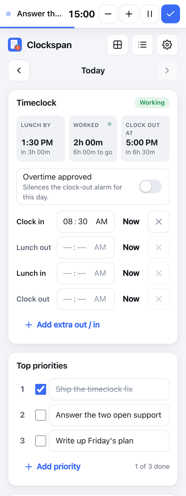
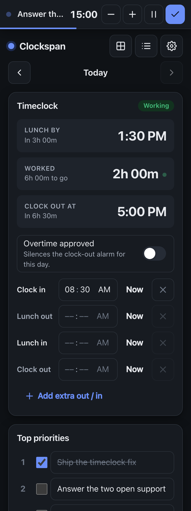
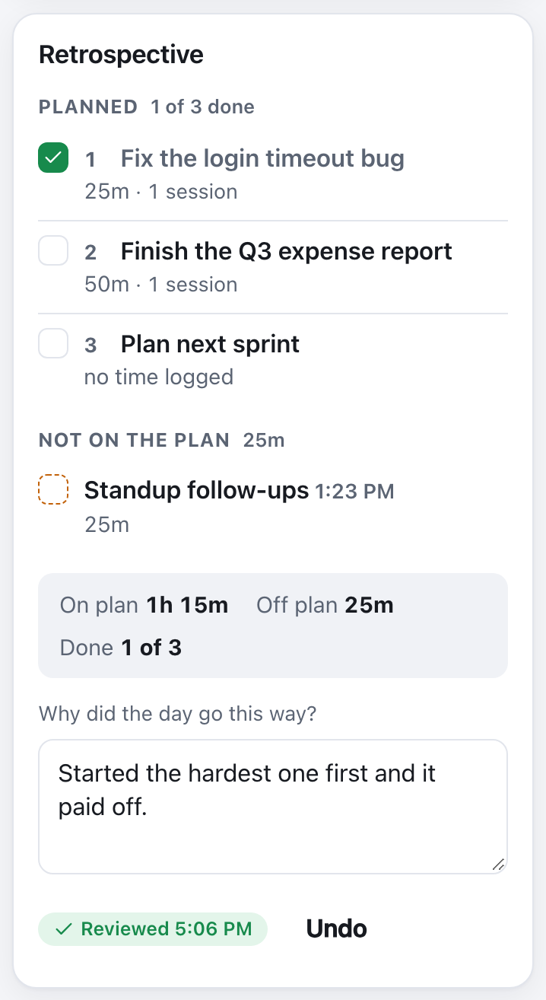
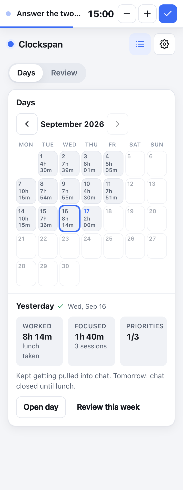
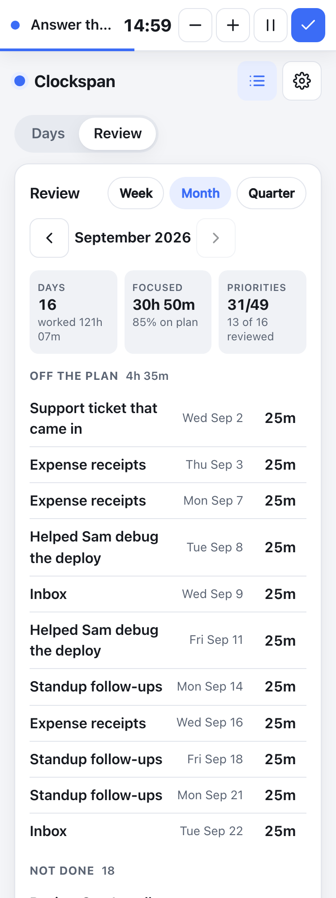
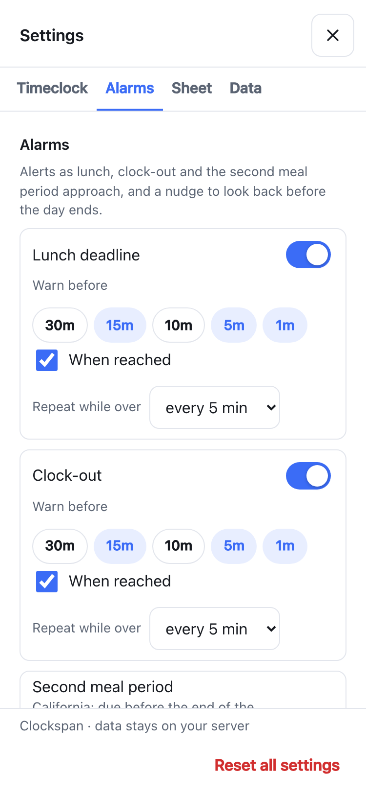
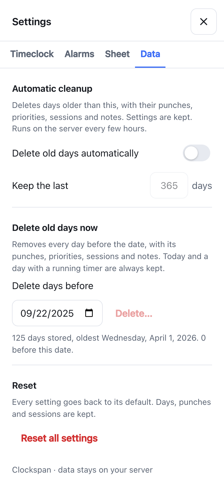

# Clockspan

*Vibe coded — built almost entirely with AI ([Claude Code](https://claude.com/claude-code)), with light human review.*

[](https://github.com/geransmith/clockspan/releases)
[](https://github.com/geransmith/clockspan/actions/workflows/ci.yml)

**Clockspan** is a self-hosted, single-day focus sheet for getting through a workday with ADHD: work smart, not hard. One page: a punch-style timeclock that works out when lunch is due and when the day ends, the few things that would make today a win, a focus timer that logs what you did, and a retrospective that puts the plan next to what happened. Every day is saved; alarms fire as deadlines approach. Runs as one Docker container with a SQLite file; works on phones and installs to the Home Screen.

<p align="center">
  
  &nbsp;&nbsp;
  
</p>

## Features

**Timeclock that plans the day for you.** Tap *Now* on *Clock in* and the sheet tells you when lunch must start (default: within 5 hours) and when your day ends (default: 8 hours worked + 30-minute lunch), live, re-planning if lunch runs long. Forgot to punch? Type the time: `0730` fills the hour, the minute and a sensible AM/PM, and saves. Times follow your browser's clock; *Settings → Timeclock → Time format* forces 12-hour or 24-hour. Extra out/in pairs for appointments, before or after lunch. An explicit clock-out ends the day, early or not, with a small celebration: a line, a burst of emoji and a "yay", and ticking a priority gets a smaller burst (*Settings → Sheet → Celebrations* turns the bursts off; the OS "reduce motion" setting does too; the sound is picked under *Settings → Alarms → Sounds*).

**A sticker chart, if you want one.** Off by default. With it on, every day on the History calendar wears a little creature for each thing it did: clocked out, lunch taken, all priorities done, a focus session logged, retrospective reviewed. The legend counts them for the month and narrows the calendar to one kind.

**Three priorities, on purpose.** New days start with three rows (adjustable). You can add more, and the sheet asks first: the nudge changes once some rows are ticked, and again once they all are. Rows can only be ticked once they have text.

**A focus timer that knows what it's for.** 15 / 25 / 50-minute sessions, ± while running, pause for the door or the bathroom (paused time isn't logged), finish early, and it logs the real duration. When it runs out it chimes and counts into the negative while it waits: add five more minutes, or finish and, if you ran over, choose between the planned length and what you actually worked. Tap one of your open priorities to link the session to it, or type something new and tick *Also add to today's priorities* when a task lands mid-day. The running timer floats at the top of every view; the start time lives on the server, so it survives reloads and phone sleep.

**Day log.** Every session with its actual duration, which priority it was for (editable after the fact), and the day's total focused time.

<p align="center">
  
</p>

**Retrospective.** The plan next to what actually happened: time logged against each priority, the sessions that weren't on the plan, rows that were added mid-day, and a note on why. A reminder fires 30 minutes before clock-out (adjustable) so you write it while you still remember.

<p align="center">
  
  &nbsp;&nbsp;
  
</p>

**History.** A month calendar with each day's hours on it (or its stickers); step back as far as your data goes. Tap a day for its worked, focused and priorities numbers and its note, then **Open day** or **Review this week**.

**Week / month / quarter review.** History → **Review** rolls the retrospectives up: how much focused time went off plan and to what, which priorities never got done, and every day's note. Tap a row to open that day.

<p align="center">
  
  &nbsp;&nbsp;
  
</p>

**Alarms.** Sound, browser notification and in-app banner as lunch, clock-out and (on long days) the second meal period approach, each with its own warn-before, when-reached and repeat rules. Each event (a warning, a deadline reached, a repeat, the timer finishing, the day completing, a priority ticked) has its own sound, picked from a few chimes and bundled clips, or none. Tiles turn amber inside the first warning window and red when you're over. An *Overtime approved* switch silences that day's clock-out alarm only; meal alarms stay on.

**Your data, your server.** Per-user sheets, history, settings and layout. Sign-in is optional: run it open on your LAN, create local accounts, or sign in through Authentik (OIDC). Old days can be deleted by hand or pruned automatically after a number of days you choose, with an optional server-wide ceiling for admins. Cards can be reordered or hidden per user.

**Phone first.** Mobile layout, 44 px tap targets, installable (Android *Install app*, iOS *Add to Home Screen*), and a *keep screen awake* option so the countdown and chime stay live.

---

## Run locally (for testing and development)

Requirements: **Node 24** (`nvm use 24` if you use nvm).

```bash
npm install
npm run dev
```

- Web app with hot reload: <http://localhost:5173>
- API: <http://localhost:3000> (Vite proxies `/api` and `/auth` to it)
- Database: `./data/focus.db` (gitignored). Delete the file to start fresh.

Other commands:

```bash
npm test               # unit tests (timeclock math, alarms) + API tests against an in-memory DB
npm run typecheck      # client + server type check
npm run lint           # oxlint (typescript + react-hooks rules)
npm run seed           # fill the local database with sample days (see below)
npm run build          # production build → dist/
npm start              # serve the production build on http://localhost:3000 (PORT to change; Docker sets 8080)
```

### Sample data

A fresh checkout has an empty database, so History, the retrospective and the week / month
/ quarter review have nothing to show. `npm run seed` fills `./data/focus.db` with sample
days so you can try those screens without punching a fortnight by hand:

- the last ten weekdays, each with clock in / lunch / clock out punches, three or four
  priorities (some ticked), a few focus sessions (most linked to a priority, one not) and a
  retrospective note. Among them: a day with an extra break, a day worked late with
  "Overtime approved", a half day with no lunch, a day that was never reviewed, and one
  cancelled session;
- today, clocked in two hours ago with one priority done and two sessions logged.

Dates are relative to the day you run it, so the sample always lands in the current week.
Run it again whenever you want the sample back: it replaces the seeded days but leaves your
settings alone. It only writes to the local database (`DATA_DIR`, default `./data`); it
never touches a Docker `/data` volume. Safe to run while `npm run dev` is up; reload the page.

```bash
npm run seed                      # the default set above
npm run seed -- --running         # also leave a 25-minute focus timer running
npm run seed -- --quarter         # every weekday since the start of last quarter, for the
                                  # month and quarter reviews
npm run seed -- --days 30         # a specific number of past weekdays
npm run seed -- --fresh           # also reset settings and sign everyone out
npm run seed -- --today 2026-03-02   # build the sample around another date
npm run seed -- --now 10:30       # today's clock-in and timer pinned to that time of day
```

### Trying the auth modes locally

```bash
AUTH_MODE=local npm run dev       # first visit shows the "create account" page
AUTH_MODE=local npm run seed      # creates users "admin" (admin) and "sam", password
                                  # clockspan-dev, each with their own sample days
```

For OIDC you need a reachable provider; see [Authentik](#authentik-oidc) below and run with the `OIDC_*` and `APP_URL` variables set (`APP_URL=http://localhost:5173` while developing).

---

## Docker

Images are published to GitHub Container Registry for `linux/amd64`:

| Tag | What it is |
| --- | --- |
| `ghcr.io/geransmith/clockspan:latest` | the newest release |
| `ghcr.io/geransmith/clockspan:0.1.0`, `:0.1` | a specific release |
| `ghcr.io/geransmith/clockspan:edge` | the latest commit on `main`; it has passed CI and nothing else |

```bash
cp .env.example .env   # optional: sign-in mode, public URL, OIDC; without it there is no sign-in
docker compose up -d
```

Then open <http://localhost:8080>. The database is in `./data` next to the compose file (`DATA_PATH` in `.env` moves it). Equivalent `docker run`:

```bash
docker run -d --name clockspan -p 8080:8080 -v /path/on/host:/data \
  -e AUTH_MODE=local ghcr.io/geransmith/clockspan:latest
```

The container drops to an unprivileged user (uid/gid 1000 by default; set `PUID`/`PGID` in `.env` to match the owner of the host directory) after taking ownership of `/data`.

To update:

```bash
docker compose pull && docker compose up -d
```

The database in the mounted volume is untouched. To build from source instead, `docker build -t ghcr.io/geransmith/clockspan:latest .` and then `docker compose up -d`; the local image wins over the registry.

### Environment variables

Set these in `.env` (start from `.env.example`, which documents each one).

| Variable | Default | Meaning |
| --- | --- | --- |
| `PORT` | `8080` (Docker) / `3000` (dev) | Listen port |
| `DATA_DIR` | `/data` (Docker) / `./data` | Where `focus.db` lives |
| `AUTH_MODE` | `none` | `none`, `local` or `oidc` |
| `APP_URL` | — | Public URL of the app. Required for `oidc`; also turns on Secure cookies when `https` |
| `TRUST_PROXY` | `false` | Number of reverse proxies in front of the app (usually `1`); Express string forms such as `loopback` or a CIDR list are passed through. Never `true`, which trusts any `X-Forwarded-For` a client sends |
| `COOKIE_SECURE` | derived from `APP_URL` | Force session cookies to `Secure` on/off |
| `SESSION_TTL_DAYS` | `30` | Sliding session lifetime |
| `RETENTION_DAYS` | unset | Server-wide ceiling on history: every user's days older than this many days (30 or more) are deleted every few hours. Unset keeps everything; users can still choose a shorter limit in Settings → Data |
| `OIDC_ISSUER` | — | Provider issuer URL (discovery is done from it) |
| `OIDC_CLIENT_ID` / `OIDC_CLIENT_SECRET` | — | Confidential client credentials |
| `OIDC_SCOPES` | `openid profile email` | Scopes to request |
| `PUID` / `PGID` | `1000` / `1000` | Docker only: own `/data` and run as this user; `0` keeps root |
| `DATA_PATH` | `./data` | Docker only: the host directory mounted at `/data`. Read by `docker-compose.yml`, not by the app |

---

## Auth and users

| Mode | Who can use it | Sign-in | Users |
| --- | --- | --- | --- |
| `none` | Anyone who can reach the port | none | one implicit user |
| `local` | Accounts you create | username + password | first account is admin; admin adds/removes users in **Settings → Users** |
| `oidc` | Whoever your provider admits | redirect to the provider | created automatically on first sign-in |

Each user has their own sheet, history, settings and layout.

**Local mode.** The first visit shows a *create account* page; that account is the admin. Passwords are hashed with scrypt. Change your password in **Settings → Account**. Forgot it?

```bash
docker exec clockspan node dist/server/cli.js reset-password <username>
# or locally: npm run reset-password -- <username>
```

Login is rate-limited to 5 attempts per 15 minutes per IP (set `TRUST_PROXY` behind a proxy so that's the real client IP). Changing your password signs out every other session.

### Authentik (OIDC)

1. **Applications → Providers → Create → OAuth2/OpenID Provider.**
   - Client type: **Confidential**
   - Redirect URIs: `https://focus.example.com/auth/callback` (exactly `${APP_URL}/auth/callback`)
   - Scopes: `openid`, `profile`, `email`
   - Note the *Client ID* and *Client Secret*.
2. **Applications → Applications → Create.** Name it, pick the provider you just made, and set the slug (e.g. `clockspan`). Use *Policy / Group / User Bindings* on this application to control who may sign in.
3. Open the provider and copy its **OpenID Configuration Issuer** URL, e.g. `https://auth.example.com/application/o/clockspan/`.
4. In `.env`:

   ```
   AUTH_MODE=oidc
   APP_URL=https://focus.example.com
   OIDC_ISSUER=https://auth.example.com/application/o/clockspan/
   OIDC_CLIENT_ID=...
   OIDC_CLIENT_SECRET=...
   TRUST_PROXY=1
   ```

The app refuses to start with a clear message if any of these are missing. If Authentik is briefly unreachable at startup the app still boots and retries discovery in the background. Sign out also ends the Authentik session when the provider advertises an end-session endpoint.

**Switching modes later.** Data is keyed by user. Going from `none` to `local` creates a fresh admin; the old implicit user's data stays in the database. To hand it to the new account:

```bash
sqlite3 /path/on/host/focus.db \
  "UPDATE days SET user_id = (SELECT id FROM users WHERE kind='local' ORDER BY id LIMIT 1) WHERE user_id = (SELECT id FROM users WHERE kind='default');"
```

(Repeat for `sessions` and `settings` if you want those too.)

---

## Using it

- **Timeclock.** Tap **Now** on *Clock in* when you start. The *Lunch by* tile counts down; punch *Lunch out* / *Lunch in* around your break, and *Clock out* when you leave. Clocking out ends the day, even if you left early. To enter a time by hand, click the hour and type: `0730` moves through hour and minute on its own, fills in AM or PM (morning for 5–11, afternoon for 12 and 1–4; a punch after your clock-in stays after it) and saves as soon as the last part is in; press `a` or `p`, or ↑/↓ on any part, to change it. A half-typed time is dropped when you click away, so what the row shows is what is stored. Need to step out for an appointment? **Add extra out / in** for as many pairs as you need. A pair you add before lunch is punched sits above lunch; otherwise it sits below. Your projected *Clock out at* accounts for everything. Came back after clocking out? Tap **Add extra out / in**: your clock-out time becomes that pair's *Out*, tap **Now** on its *In*, and you get a fresh *Clock out* row.
- **Top priorities.** A row can only be ticked once it has text. **Add priority** adds a row; past three (or your configured count) it asks first, gently. With some rows ticked, the notice lists what's done and the buttons read *Add anyway / Finish what's open*; with everything ticked, *Add a bonus / Stop here*. Rows beyond your default can be removed with the ×. *Settings → Sheet → Priorities → Rows per day* sets how many rows a new day starts with.
- **Timer.** Type what you're about to do, tap 15/25/50. Or tap one of the *Working on* chips (your open priorities) and the session is linked to that row. New task from your manager? Type it, tick **Also add to today's priorities**, start: the first empty row fills in and the session is linked. The bar at the top follows you around; **−5m / +5m** adjust the current session, **Pause** stops the clock for a break (the time away isn't logged, and a pause left for an hour closes the session where it began), **Finish** ends it early and logs the real duration. Reaching zero chimes and the countdown goes negative while it waits: **+5m** keeps going, and **Finish** logs the planned length, or, once you are a minute or more over, asks whether to log the planned length or the time you actually worked; left unanswered for ten minutes it logs the planned length on its own. Timers keep correct time across reloads and phone sleep because the start time lives on the server.
- **Day log.** Rows show a small number when the session was for a priority. Tap a label to edit it, or to change which priority it was for (*Unplanned* unlinks it).
- **Retrospective.** The card at the bottom of the sheet. *Planned* is each priority with the focused time logged against it (rows written after your first session are marked *added HH:MM*); *Not on the plan* is every session without a priority. Write why the day went the way it did and tap **Mark reviewed**. *Settings → Alarms → Retrospective* controls the reminder (default: 30 minutes before clock-out; it isn't silenced by overtime approval, and marking the day reviewed clears it). The banner's **Open retrospective** button takes you to the card.
- **Review.** History → **Review**. Pick *Week* (Monday to Sunday), *Month* or *Quarter* and step back with ◀. Tiles show days and hours worked, focused time and how much of it was on plan, priorities done and days reviewed. Below: *Off the plan* (unplanned sessions, longest first), *Not done* (priorities never ticked) and *Why* (each day's note). Tap any row to open that day.
- **Alarms.** Settings → Alarms. Per alarm: warn-before chips (30/15/10/5/1 min), *when reached*, and *repeat while over*. The tiles turn amber when you're inside the first warning window and red when you're over.
  - **Second meal period.** On a day heading past 10 hours worked (overtime approved, already over your target, or a target that long) the sheet shows when your 10th hour ends and alarms before it. Any break after lunch counts as taken. Adjust the threshold under *Settings → Timeclock*, or turn the alarm off if you've waived it.
  - **Overtime approved.** A switch on the timeclock card, and a button on the clock-out alarm banner, that silences that day's clock-out alarm. Meal alarms stay on. If overtime doesn't apply to you, turn off *Settings → Timeclock → Overtime approval* and both disappear.
  - **About the defaults.** Lunch within 5 hours, a second meal period after 10 hours worked, and keeping meal alarms on during approved overtime all follow California labor rules, because that's where the author works. Other states and countries differ. Everything is adjustable in Settings, and pull requests that add presets or rules for other places are welcome.
- **Sticker chart.** Off by default: turn it on under *Settings → Sheet → History*. Every day on the History calendar then wears a sticker for each thing it did (clocked out, lunch taken, all priorities done, a focus session logged, retrospective reviewed) instead of its hours, with the month's count on top and a day that earned all five picked out. The legend chips count each kind; tap one to show only that sticker, tap again for all of them. Today updates as you go. Hover a sticker for what it was for.
- **Layout.** Tap **Customize** to drag cards (long-press on phones), use ▲/▼, or hide a card. Hidden cards appear in a strip at the bottom while customizing. *Settings → Sheet → Layout → Reset to default* restores everything.
- **Settings.** Five tabs: *Timeclock* (day length, lunch, second meal, time format, overtime approval), *Alarms* (per-alarm rules, sound, notifications, a sound per event with a Test button), *Sheet* (priorities, timer, celebrations, the sticker chart and weekends on the calendar, layout), *Data* (old-day cleanup) and *Account* (local accounts only). **Reset all settings** in the dialog footer puts every setting back to its default; days, punches and sessions are untouched.
- **Data.** Settings → Data. *Delete old days automatically* keeps the last N days (30 to 3650) and drops the rest, with their punches, priorities, sessions and notes; the server checks every few hours. *Delete days before* a date does the same once, after showing how many days it will remove. Today and a day with a running timer are never deleted; settings are kept. If the admin set `RETENTION_DAYS`, the tab says so and that ceiling applies whatever you choose.
- **Past days.** Use ◀ ▶ or the date picker on the sheet, or **History** → **Days**: a month calendar (step back with ◀) with the hours worked on each day. Tap a day to see its worked, focused and priorities numbers, a tick once its retrospective is reviewed, and its note; **Open day** goes to that sheet and **Review this week** to that week's review. Only work here? *Settings → Sheet → History → Show weekends* off drops Saturday and Sunday from the calendar (and from the sticker counts); a weekend day is still reachable from the sheet's date picker. Past days are editable; timers can only start on today.
- **Phone.** Add to Home Screen (Android: *Install app*; iOS: Share → *Add to Home Screen*). Browser notifications on iOS only work from the installed app. *Keep screen awake* keeps the countdown and chime live while the app is open; if the phone sleeps anyway, the alert fires when you come back.

## Exposing it to the internet

The app is built to sit behind a reverse proxy on your own domain. Before opening the port:

- **Use `AUTH_MODE=local` or `oidc`.** `none` means anyone who reaches the port owns the data; the server logs a warning at startup when it's running that way.
- **Terminate HTTPS at the proxy** and set `APP_URL=https://your.domain`. That marks the session cookie `Secure` and turns on HSTS.
- **Set `TRUST_PROXY` to the number of proxies** between the internet and the container, usually `1`. With `true`, Express believes whatever `X-Forwarded-For` a client sends, which lets an attacker dodge the login rate limit.
- **Finish setup first.** In `local` mode the first visitor creates the admin account, so do that before the proxy is open to the internet. Once `APP_URL` is https the session cookie is Secure and only an https page can keep it, so sign in through the proxy's https address (the sign-in page says so when it is opened over plain http); for a one-off LAN setup, start with `COOKIE_SECURE=false` and remove it afterwards.
- Keep `/data` backed up (below). WebSockets are not used, so any proxy works.

What the app does on its own: a strict same-origin Content-Security-Policy plus `nosniff`, `frame-ancestors 'none'` and `Referrer-Policy` on every response, and `Cache-Control: no-store` on every API answer; HttpOnly, SameSite=Lax session cookies with the token stored hashed; scrypt password hashes; a per-IP login limit; a non-root container user. It is still a small self-hosted app: keep it updated and behind the protections your proxy already gives you.

## Backups

The whole state is one file: `focus.db` (plus `-wal`/`-shm` while running). Either stop the container and copy the directory, or take a consistent snapshot live:

```bash
sqlite3 /path/on/host/focus.db ".backup /path/to/backups/focus-$(date +%F).db"
```

Deleting old days (Settings → Data, or `RETENTION_DAYS`) is permanent and compacts the file afterwards, so take a backup first if you might want them back.

## Development notes

See [AGENTS.md](AGENTS.md) for the repo map, architecture rules and checklists for adding cards, settings, alarms and routes.

Every change is a squash-merged pull request with CI green; a release is a version-bump PR, and merging it builds the image, tags it and writes the release notes. The rules and the checklist are in [CONTRIBUTING.md](CONTRIBUTING.md).

The bundled sounds are CC0 clips from Freesound; [client/src/sounds/README.md](client/src/sounds/README.md) lists each one's author and source.

The screenshots above come from `npm run screenshots`. It starts the dev server if one isn't running, seeds sample data with the clock pinned to 10:30, drives a local Chromium headless and writes `docs/screenshots/*.png`. It looks for Chrome, Chromium, Edge or Brave and otherwise fetches a Chrome for Testing build into `node_modules/.cache` the first time; set `CHROME_BIN` to force a particular browser.
