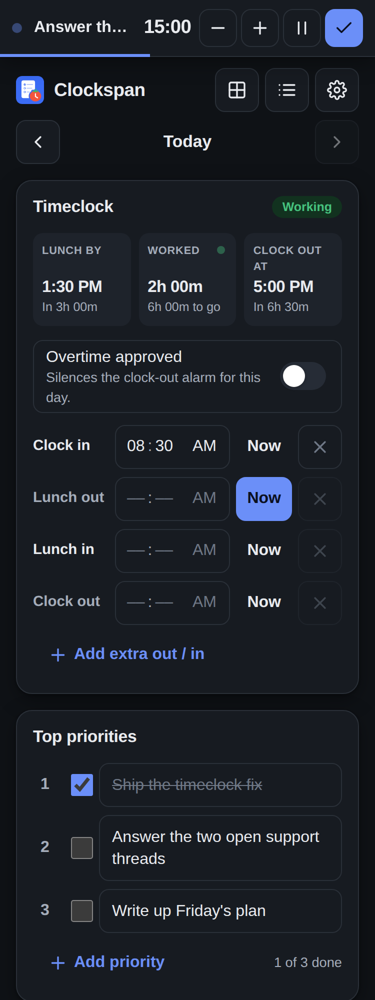
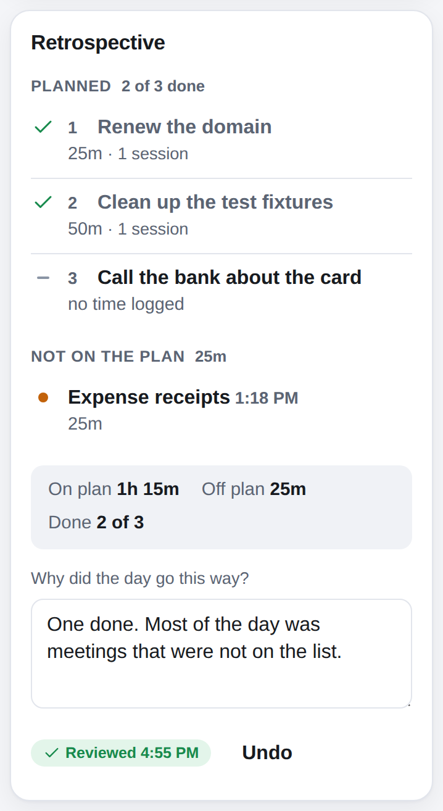
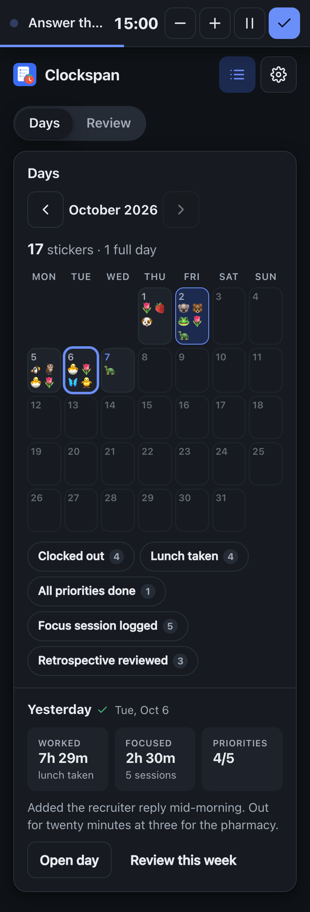
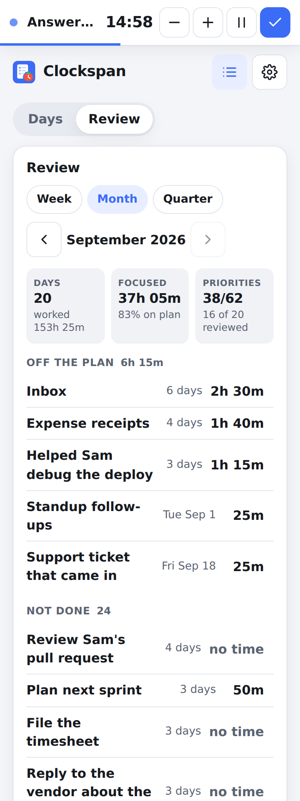
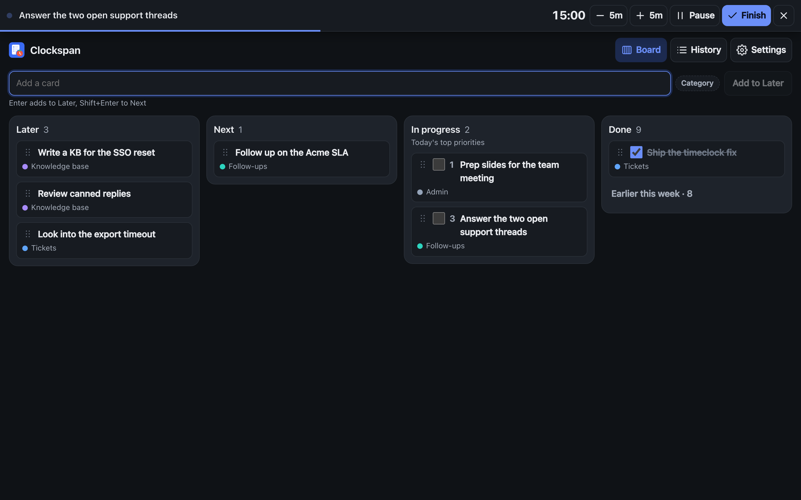
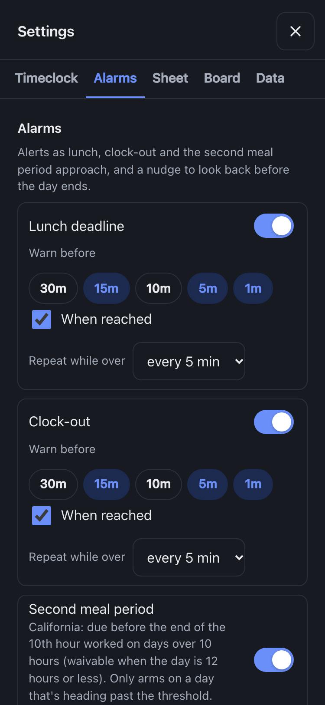
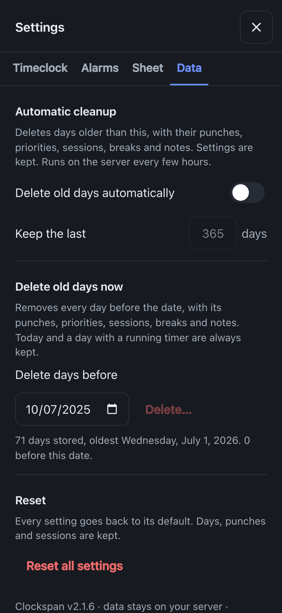

# Clockspan

*Vibe coded — built almost entirely with AI ([Claude Code](https://claude.com/claude-code)), with light human review.*

[](https://github.com/geransmith/clockspan/releases)
[](https://github.com/geransmith/clockspan/actions/workflows/ci.yml)

**Clockspan** is a self-hosted, single-day focus sheet for getting through a workday with ADHD. One page: a punch-style timeclock that works out when lunch is due and when the day ends, a short list of the day's priorities, a focus timer that logs what you did, and a retrospective that puts the plan next to what happened. Every day is saved, alarms fire as deadlines approach, and History rolls the days up into a week, month or quarter review. A board holds the tasks that aren't for today. Runs as one Docker container with a SQLite file; works on phones and installs to the Home Screen.

<p align="center">
  
</p>

## Features

**Timeclock.** Tap *Now* on *Clock in* and the sheet works out when lunch must start (default: within 5 hours) and when your day ends (default: 8 hours worked plus a 30-minute lunch), and re-plans if lunch runs long, or leaves it out once the deadline passes without one. A day with no more work than the lunch window (5 hours by default) needs no lunch, so none is planned or alarmed. The *Now* for the next punch is the highlighted one. Forgot to punch? Type the time. Extra out/in pairs cover appointments before or after lunch. The day ends at the *Clock out* once the clock reaches it, early or not, with a small celebration. **Work day → Change** gives one day its own length (a half day, a long one), and the clock-out time, alarms and History follow it. *This week* under the tiles adds up the week against your work week (40 hours by default). Punches out of order are pointed out, and that day counts in no totals until they're fixed. A shift past midnight is two days: clock out at 11:59 PM, clock in at 12:00 AM. Times follow the browser's 12- or 24-hour clock unless you pick one.

**Priorities.** New days start with three rows (adjustable). You can add more; past three one-off rows (or your Rows per day, if higher), the sheet asks first: the nudge changes once some rows are ticked, and again once they all are. Rows can only be ticked once they have text. A task has one name, one category and a plain-text note that stays hidden until you open it: change any of them on any day, or on the board, and it changes on every day it is on. × takes a task off the day; when it is on other days, has time logged or has a note, it asks whether to take it off this day only or delete it everywhere, and logged time stays in the day log either way. A new day's empty list offers whatever the last day left unticked and the top of the board's *Next*, in one tap, as the same tasks. With the sheet open on a laptop and a phone at once, the two merge their edits row by row.

**Focus timer.** 15, 25 or 50-minute sessions (or three lengths of your own) you can stretch, shorten or pause (paused time isn't logged). When one runs out it chimes and waits for you to add time or finish; a minute or more over, it asks whether to log the planned length or the time you worked, and after ten minutes with no answer it logs the plan. A pause left for an hour ends the session where the pause began. Link a session to one of your open priorities, or type a new task and it goes on today's list as the session starts. **Done** finishes the session and ticks its priority. The running timer stays at the top of every view, and since its start time lives on the server it survives reloads and phone sleep. Between sessions, **Break** counts down a short break (5 minutes by default), says when it's over, and logs it in the day log. A break lives on the server like a timer, so it counts down on every device and survives a reload; starting a session ends it. One ended within its first minute (Break pressed by mistake) isn't logged. Turn on *Suggest a break after each session* and finishing a session offers a break sized to it, Pomodoro style: a fifth of the session (25 minutes earn 5), and after four sessions in a row a long break of a fifth of all four, up to 30 minutes.

**Day log.** Every session with its actual duration, which priority it was for, under that priority's current name, and the day's total focused time. A session can be moved to another priority after the fact, or set to *Unplanned* and given its own label. The breaks you took sit between the sessions, with the day's total time on breaks.

<p align="center">
  
</p>

**Retrospective.** The plan next to what actually happened: time logged against each priority, the sessions that weren't on the plan, rows that were added mid-day, and a note on why. A reminder fires 30 minutes before clock-out (adjustable) so you write it while you still remember. Until you clock out, today's card is one line of totals.

<p align="center">
  
  &nbsp;&nbsp;
  
</p>

**History.** A month calendar with each day's hours on it and a thin bar for how much of the work day that was, green once the target was met (or its stickers instead); step back as far as your data goes. Tap a day for its worked, focused and priorities numbers, a tick once reviewed, and its note, then **Open day** or **Review this week**.

**Sticker chart.** Off by default. With it on, every day on the History calendar wears a little creature for each thing it did: clocked out, lunch taken, all priorities done, a focus session logged, retrospective reviewed. A legend counts them for the month.

**Week / month / quarter review.** History → **Review** rolls the days up: hours worked against a target, focused time and how much of it was on plan, breaks, rows added mid-day, where the off-plan time went, the time under each category, how often each recurring priority got ticked, which priorities never got done, and every day's note. Repeated rows are merged, so a chore that came back on five days is one row with its total, and long lists fold after eight rows. Tap a row to open that day (the latest one, for a merged row).

<p align="center">
  
</p>

**Board, categories and recurring priorities.** The Board page is for tasks that come up but aren't for today, in four columns: *Later*, *Next*, *In progress* and *Done*. *In progress* is today's priorities list itself, so a row written on the sheet shows up there and a card moved there lands on today's list. A task left open on an earlier day waits in *Next* for two weeks. *Done* holds this week. Click a card to rename it, set its category, note and repeat days, move it or delete it. Cards drag with a mouse, a held finger or the keyboard (Space, arrows, Space); below 900 px the board shows one column at a time. A card can start the focus timer; one in *Later* or *Next* goes onto today's list first. Categories go on tasks and sessions, and the review adds up the time under each; change a task's category and its past time moves with it. Any card can repeat on the weekdays you pick, which makes it a recurring priority: on those days the sheet offers it for today's list, and the review counts how often it got done.

<p align="center">
  
  &nbsp;&nbsp;
  
</p>

**Alarms.** Sound, browser notification and in-app banner as lunch, clock-out and (on long days) the second meal period approach, each with its own warn-before, when-reached and repeat rules, and a sound per kind of event. The second meal period alarm comes before the 10th hour on a day heading past it. An *Overtime approved* switch silences that day's clock-out alarm only; meal alarms stay on. Finishing the day, reaching the work week and ticking a priority get a burst of emoji and a sound, each of which can be turned off. The defaults (lunch within 5 hours, a second meal after 10, meal alarms on during overtime) follow California rules, where the author works; everything is adjustable, and pull requests with rules for other places are welcome.

**Salaried or exempt.** *Settings → Timeclock* has a switch for each part that may not apply: *Meal periods* (and *Lunch punches* with them), *Overtime* and *Show hours*. If you don't punch at all, hide the timeclock card; the rest of the sheet works without it.

**Two devices.** With the app open on a laptop and a phone, a change saved on one shows on the other within a second. Priority lists merge row by row; for a task's name, category or note the later change wins. There is one timer, and each device raises its own alarms.

**Sign-in and data.** Per-user sheets, history, boards, settings and layout. Sign-in is optional: run it open on your LAN, create local accounts, or sign in through Authentik (OIDC). Old days can be deleted by hand or pruned automatically after a number of days you choose, with an optional server-wide ceiling (`RETENTION_DAYS`). *Reset all settings* puts the settings back and leaves days and the board alone.

**Layout.** Each user can reorder or hide the sheet's cards. A window 1100 px wide or more shows them in two columns, and any card can move to the other one.

**Keyboard.** Outside a text box: `N` adds a priority (on the board, a card in *Later*), `S`, `B` and `H` go to the sheet, the board and History, `P` pauses or resumes the timer, `+` adds time, `F` finishes it once time's up, and `R` starts a break. `?` lists them, and one switch turns them off.

**Phones.** Mobile layout, 44 px touch targets, installable (Android *Install app*, iOS *Add to Home Screen*; iOS shows notifications only from the installed app), a *keep screen awake* option so the countdown and chime stay live, and a light or dark theme that follows the device unless you pick one in Settings.

---

## Run locally (for testing and development)

Requirements: **Node 24** (`nvm use` picks it up from `.nvmrc`). On an older Node, npm refuses to install or run anything.

```bash
npm install
npm run dev
```

- Web app with hot reload: <http://localhost:5173>
- API: <http://localhost:3000> (Vite proxies `/api` and `/auth` to it)
- Vite answers on this machine only, but the API on :3000 listens on every network interface: under the default `AUTH_MODE=none`, anyone on the same network can read and change the dev database through it. To try the app from a phone on the same network, run `npm run dev:server` and `npm run dev:client -- --host` in two terminals and open the network address Vite prints.
- Database: `./data/focus.db` (gitignored). Delete the file to start fresh.

Other commands:

```bash
npm test               # unit tests (timeclock math, alarms), hook and component tests + API tests against an in-memory DB
npm run test:coverage  # the same, failing unless server/, shared/, the client's API calls, libs and hooks are 100% covered (CI runs this)
npm run typecheck      # client + server type check
npm run lint           # oxlint (correctness, type-aware TypeScript, React hooks and accessibility rules)
npm run format         # Prettier (CI runs format:check)
npm run seed           # fill the local database with sample days (see below)
npm run build          # production build → dist/
npm start              # serve the production build on http://localhost:3000 (PORT to change; Docker sets 8080)
```

### Sample data

A fresh checkout has an empty database, so History, the retrospective and the week / month
/ quarter review have nothing to show. `npm run seed` fills `./data/focus.db` with the last
ten weekdays, each with punches, priorities, focus sessions and a retrospective note (an extra
out / in pair, an overtime day, a day never marked reviewed and a half day among them), and
today, clocked in two hours ago. It also writes four categories, two recurring priorities and
some tasks on the board. [AGENTS.md](AGENTS.md#dev-data-is-disposable) and
[server/dev/seed.ts](server/dev/seed.ts) say what each day holds.

Dates are relative to the day you run it, so the sample always lands in the current week.
Each run first deletes every day, task (recurring priorities included) and category of the user
it seeds, including ones you entered by hand; settings stay unless you pass `--fresh`. It only
writes to the local database (`DATA_DIR`, default `./data`); it never touches a Docker `/data`
volume. Safe to run while `npm run dev` is up; reload the page.

```bash
npm run seed                      # the default set above
npm run seed -- --running         # also leave a 25-minute focus timer running, started ten
                                  # minutes ago
npm run seed -- --quarter         # every weekday since the start of last quarter, for the
                                  # month and quarter reviews
npm run seed -- --days 30         # a specific number of past weekdays
npm run seed -- --fresh           # also reset the seeded users' settings and sign them out
npm run seed -- --today 2026-03-02   # the same sample around another date, at the current
                                     # time of day
npm run seed -- --now 10:30       # pin the time of day: clock-in two hours before it, a
                                  # --running timer ten minutes before it
```

### Trying the auth modes locally

```bash
AUTH_MODE=local npm run dev       # first visit shows the "create account" page; its setup code is in the terminal
AUTH_MODE=local npm run seed      # creates users "admin" (admin) and "sam", password
                                  # clockspan-dev, each with their own sample days
```

For OIDC you need a reachable provider; see [Authentik](#authentik-oidc) below and run with the `OIDC_*` and `APP_URL` variables set (`APP_URL=http://localhost:5173` while developing).

---

## Docker

Images are published to GitHub Container Registry for `linux/amd64` and `linux/arm64` (a Raspberry Pi 4 or 5 on a 64-bit OS, an ARM home server); Docker pulls the one that matches the host. The image holds Node and the app, without npm, npx, corepack or yarn. The tags:

| Tag | What it is |
| --- | --- |
| `ghcr.io/geransmith/clockspan:latest` | the newest release |
| `ghcr.io/geransmith/clockspan:X` | the newest release of one major version, e.g. `:2`: new features and fixes, never a breaking change |
| `ghcr.io/geransmith/clockspan:X.Y.Z`, `:X.Y` | a specific release (`:X.Y` follows its patch releases) |
| `ghcr.io/geransmith/clockspan:edge` | built from `main` after each merge; it has passed CI and nothing else. When two merges land close together their builds race, and `:edge` can stay on the earlier one until the next merge |

Versions follow [Semantic Versioning](https://semver.org) from 1.0.0. A major release (2.0.0) is the only kind that can need something from you, such as a changed variable; its release notes open with a *Breaking changes* section that says what to do. [CONTRIBUTING.md](CONTRIBUTING.md#releases) has the full rule.

```bash
cp .env.example .env   # optional: sign-in mode, public URL, OIDC; without it there is no sign-in
docker compose up -d
```

Then open <http://localhost:8080>. The database is in `./data` next to the compose file (`DATA_PATH` in `.env` moves it). Equivalent `docker run`:

```bash
docker run -d --name clockspan -p 8080:8080 -v /path/on/host:/data \
  -e AUTH_MODE=local ghcr.io/geransmith/clockspan:latest
```

The container drops to an unprivileged user (uid/gid 1000 by default; set `PUID`/`PGID` in `.env` to match the owner of the host directory) after taking ownership of `/data`.

To update:

```bash
docker compose pull && docker compose up -d
```

The database stays in the mounted volume. A new release migrates it forward when it starts, and going back to an older release after that isn't supported, so take a backup first (see [Backups](#backups)). A page left open during the update shows *Clockspan was updated* with a **Reload** button the next time it hears from the server; reload it so your changes keep saving. A page opened before v2.4.0 has no such notice, so reload it by hand. To build from source instead, `docker build -t ghcr.io/geransmith/clockspan:latest .` and then `docker compose up -d`; the local image wins over the registry.

### Unraid

The Unraid template, [`unraid/clockspan.xml`](unraid/clockspan.xml), keeps the database in `/mnt/user/appdata/clockspan`, runs the app as `99:100` (`PUID`/`PGID`) and serves it on port 8080. Every variable below is a field on its form except `PORT` and `DATA_DIR`, which the image sets, and `DATA_PATH`, whose place the *Data* path takes. The sign-in mode (a dropdown) and the App URL are on the form itself; the rest are under *Show more settings*. Fields left blank take the defaults.

Install it from the **Apps** tab (search *Clockspan*). Without the Community Applications plugin, add the template by hand from the Unraid terminal, then pick **clockspan** under *Docker → Add Container → Template*:

```bash
wget -O /boot/config/plugins/dockerMan/templates-user/my-clockspan.xml https://raw.githubusercontent.com/geransmith/clockspan/main/unraid/clockspan.xml
```

### Environment variables

Set these in `.env` (start from `.env.example`, which documents each one) or in the Unraid template's fields. A variable set to an empty value counts as unset, so its default applies. The server checks each value it reads when it starts, and one it can't read stops it with a message that names the variable. `COOKIE_SECURE` is the exception: a value it can't read is logged and ignored.

| Variable | Default | Meaning |
| --- | --- | --- |
| `PORT` | `8080` (Docker) / `3000` (from source) | Listen port. Running from source only: under Docker, change the host side of the port mapping instead |
| `DATA_DIR` | `/data` (Docker) / `./data` (from source) | Where `focus.db` lives. Running from source only: under Docker, `DATA_PATH` (or the Unraid *Data* path) picks the host directory |
| `AUTH_MODE` | `none` | `none`, `local` or `oidc` |
| `APP_URL` | — | Public URL of the app: scheme and host only (a path is ignored with a warning). Required for `oidc`; also turns on Secure cookies and HSTS when `https` |
| `ALLOWED_HOSTS` | — | `AUTH_MODE=none` only: other host names the app answers to, comma-separated; a leading dot (`.lan`) takes a domain and every name under it. Which names always work: see [Auth and users](#auth-and-users) |
| `TRUST_PROXY` | `false` | Number of reverse proxies in front of the app (usually `1`), or the proxies' addresses: `loopback`, `linklocal`, `uniquelocal`, IP addresses and CIDR ranges, comma-separated. Never `true`: the server starts with it and logs a warning, but it trusts any `X-Forwarded-For` a client sends, which defeats the login rate limit |
| `COOKIE_SECURE` | derived from `APP_URL` | Force session cookies to `Secure` and the HSTS header on (`true`) or off (`false`); `1`/`0`, `yes`/`no` and `on`/`off` work too |
| `SESSION_TTL_DAYS` | `30` | Sliding session lifetime |
| `RETENTION_DAYS` | unset | Server-wide ceiling on history: every user's days older than this many days (30 to 3650) are deleted every few hours. Unset keeps everything; users can still choose a shorter limit in Settings → Data |
| `OIDC_ISSUER` | — | Provider issuer URL, `https://` only (discovery is done from it) |
| `OIDC_CLIENT_ID` / `OIDC_CLIENT_SECRET` | — | Confidential client credentials |
| `OIDC_SCOPES` | `openid profile email` | Scopes to request |
| `PUID` / `PGID` | `1000` / `1000` | Docker only: own `/data` and run as this user and group; `PUID=0` keeps root |
| `DATA_PATH` | `./data` | Docker only: the host directory mounted at `/data`. Read by `docker-compose.yml`, not by the app |

---

## Auth and users

| Mode | Who can use it | Sign-in | Users |
| --- | --- | --- | --- |
| `none` | Anyone who can reach the port | none | one implicit user |
| `local` | Accounts you create | username + password | first account is admin; admin adds/removes users in **Settings → Account** |
| `oidc` | Whoever your provider admits | redirect to the provider | created automatically on first sign-in |

Each user has their own sheet, history, board, settings and layout.

**No sign-in (`none`).** Meant for a network you trust: anyone who can reach the port can read and change the data. A web page from another site, open in a browser on that network, can't: the browser won't let it read the API, and the app refuses its writes. That site could still point one of its own names at the server's address (DNS rebinding) and pass as the app, so the app answers only names no outside site can use, plus the ones you list. IP addresses (`http://192.168.1.10:8080`), `localhost`, one-word names (`http://tower:8080`), `.local`, `.home.arpa` and `.internal` names and `APP_URL`'s name always work. Reach the app by another name, such as a domain on your reverse proxy or a `.lan` name? Set `APP_URL` to it, or list it in `ALLOWED_HOSTS`; until then the page says *Can't reach the server* and names the host to add.

**Local mode.** The first visit shows a *create account* page; that account is the admin. The page asks for a setup code, which the server prints in its log when it starts with no account yet (`docker logs clockspan`, or the container's log in Unraid): someone who finds a fresh install before you can't claim it. A restart prints a new code. The admin adds users in **Settings → Account** with a temporary password; a new user has to choose their own the first time they sign in, before the sheet opens. Passwords are hashed with scrypt. Change your password in **Settings → Account**. Forgot it?

```bash
docker exec clockspan node dist/server/cli.js reset-password <username>
# or locally: npm run reset-password -- <username>
```

Without a password after the username, the command prints a temporary one, and the user chooses their own at the next sign-in. Prefer that form: a password typed after the username stays in your shell history. Either way, every session of that user is signed out.

Login is rate-limited to 5 failed attempts per 15 minutes per IP, counting an IPv6 client by its /64 (set `TRUST_PROXY` behind a proxy so that's the real client IP; the server logs a warning when a proxy's `X-Forwarded-For` arrives without it), and to 50 failed attempts per 15 minutes per username from all addresses together. A locked account can't sign in on a new device until the 15 minutes pass; devices already signed in keep working. Changing your password signs out every other session.

### Authentik (OIDC)

1. **Applications → Providers → Create → OAuth2/OpenID Provider.**
   - Client type: **Confidential**
   - Redirect URIs: `https://focus.example.com/auth/callback` (exactly `${APP_URL}/auth/callback`, with only `APP_URL`'s scheme and host, in lowercase, which is how the app uses it)
   - Scopes: `openid`, `profile`, `email`
   - Note the *Client ID* and *Client Secret*.
2. **Applications → Applications → Create.** Name it, pick the provider you just made, and set the slug (e.g. `clockspan`). Use *Policy / Group / User Bindings* on this application to control who may sign in.
3. Open the provider and copy its **OpenID Configuration Issuer** URL, e.g. `https://auth.example.com/application/o/clockspan/`.
4. In `.env`:

   ```
   AUTH_MODE=oidc
   APP_URL=https://focus.example.com
   OIDC_ISSUER=https://auth.example.com/application/o/clockspan/
   OIDC_CLIENT_ID=...
   OIDC_CLIENT_SECRET=...
   TRUST_PROXY=1
   ```

The app refuses to start if `APP_URL`, `OIDC_ISSUER`, `OIDC_CLIENT_ID` or `OIDC_CLIENT_SECRET` is missing, or if `OIDC_ISSUER` isn't an `https://` URL (the sign-in library never contacts a provider over plain http). If Authentik is briefly unreachable at startup the app still boots and retries discovery in the background. Sign out also ends the Authentik session when the provider advertises an end-session endpoint.

**Switching modes later.** Data is keyed by user. A sign-in belongs to the mode it was made in, so after a switch everyone signs in again (under `local` with no account yet, the first visit shows the create-account page). Going from `none` to `local` creates a fresh admin; the old implicit user's data stays in the database. To hand it to the new account, stop the container and run the script below before the new account records a day of its own (a user has one row per date, so a date both accounts used stops the script and nothing moves). Days move together with their sessions and breaks, which belong to a user as well as a day. Tasks (each priority, board card and recurring priority) and categories move too; their ids are random, so the two accounts never clash on them. The last two statements bring the old settings along, replacing any the admin saved; leave them out to keep the admin's.

```bash
sqlite3 /path/on/host/focus.db <<'SQL'
.bail on
BEGIN;
CREATE TEMP TABLE handover AS SELECT
  (SELECT id FROM users WHERE kind = 'default') AS from_id,
  (SELECT id FROM users WHERE kind = 'local' ORDER BY id LIMIT 1) AS to_id;
UPDATE days        SET user_id = (SELECT to_id FROM handover) WHERE user_id = (SELECT from_id FROM handover);
UPDATE sessions    SET user_id = (SELECT to_id FROM handover) WHERE user_id = (SELECT from_id FROM handover);
UPDATE breaks      SET user_id = (SELECT to_id FROM handover) WHERE user_id = (SELECT from_id FROM handover);
UPDATE items       SET user_id = (SELECT to_id FROM handover) WHERE user_id = (SELECT from_id FROM handover);
UPDATE categories  SET user_id = (SELECT to_id FROM handover) WHERE user_id = (SELECT from_id FROM handover);
DELETE FROM settings WHERE user_id = (SELECT to_id FROM handover)
                AND EXISTS (SELECT 1 FROM settings WHERE user_id = (SELECT from_id FROM handover));
UPDATE settings SET user_id = (SELECT to_id FROM handover) WHERE user_id = (SELECT from_id FROM handover);
COMMIT;
SQL
```

Going from `none` to `oidc` works the same way. Sign in through your provider once first, since that creates your account, then run the script with `kind = 'oidc'` in place of `kind = 'local'`.

---

## Exposing it to the internet

The app is built to sit behind a reverse proxy on a host name of its own (`focus.example.com`); serving it under a path (`example.com/clockspan`) isn't supported. Before opening the port:

- **Use `AUTH_MODE=local` or `oidc`.** `none` means anyone who reaches the port owns the data; the server logs a warning at startup when it's running that way. The exception is a proxy that signs people in itself (forward auth from Authelia or Authentik, for example), and only if the container's port can't be reached from the internet except through that proxy. Docker's `-p 8080:8080` listens on every interface and gets past ufw, so on a public server publish `127.0.0.1:8080:8080` or put the proxy on the container's Docker network and drop the port.
- **Terminate HTTPS at the proxy** and set `APP_URL=https://your.domain`. That marks the session cookie `Secure` and turns on HSTS.
- **Set `TRUST_PROXY` to the number of proxies** between the internet and the container, usually `1`. With `true`, Express believes whatever `X-Forwarded-For` a client sends, which lets an attacker dodge the login rate limit.
- **Finish setup first.** In `local` mode the admin account is created on the first visit, with the setup code from the server log; do that before the proxy is open to the internet anyway. Once `APP_URL` is https the session cookie is Secure and only an https page can keep it, so sign in through the proxy's https address (the sign-in page says so when it is opened over plain http); for a one-off LAN setup, start with `COOKIE_SECURE=false` (which also turns HSTS off) and remove it afterwards.
- Keep `/data` backed up (below).
- **Live updates** come over `/api/changes`, a server-sent event stream: one long answer with a comment every 25 s and `X-Accel-Buffering: no`. nginx, Caddy, Traefik and Cloudflare Tunnel pass it as it is. A proxy that buffers or compresses it leaves each device picking up the other's changes every minute instead. Over plain HTTP/1.1 a browser opens at most six connections to a host and each tab on screen keeps one, so with several tabs open serve the app over HTTPS, which proxies usually give HTTP/2.

What the app does on its own: a strict same-origin Content-Security-Policy plus `nosniff`, `frame-ancestors 'none'` and `Referrer-Policy` on every response, and `Cache-Control: no-store` on every API answer; API writes that the browser marks as sent from another site are refused (this also covers `AUTH_MODE=none`, where there is no cookie); under `AUTH_MODE=none` the API also refuses host names it doesn't know, which stops DNS rebinding (see [Auth and users](#auth-and-users)); HttpOnly, SameSite=Lax session cookies with the token stored hashed; scrypt password hashes; a per-IP login limit (per /64 for IPv6); a non-root container user. It is still a small self-hosted app: keep it updated and behind the protections your proxy already gives you. Found a hole? [SECURITY.md](SECURITY.md) says how to report it privately.

## Backups

The whole state is one file: `focus.db` (plus `-wal`/`-shm` while running). Either stop the container and copy the directory, or take a consistent snapshot live:

```bash
sqlite3 /path/on/host/focus.db ".backup /path/to/backups/focus-$(date +%F).db"
```

A page left open while you restore a backup shows *Restored from a backup* with a **Reload** button the next time it hears from the server; reload it to see the restored data.

Deleting old days (Settings → Data, or `RETENTION_DAYS`) or a user (Settings → Account) is permanent and compacts the file afterwards, so take a backup first if you might want them back.

## Development notes

See [AGENTS.md](AGENTS.md) for the repo map, architecture rules and checklists for adding cards, settings, alarms and routes.

Every change is a squash-merged pull request with CI green; a release is a version-bump PR, and merging it builds the image, tags it and writes the release notes. The rules and the checklist are in [CONTRIBUTING.md](CONTRIBUTING.md).

The bundled sounds are CC0 clips from Freesound; [client/src/sounds/README.md](client/src/sounds/README.md) lists each one's author and source.

The screenshots above come from `npm run screenshots`. It starts the dev server if one isn't running, seeds sample data with the clock pinned to 10:30 (replacing the dev database's days and board and resetting the default user's settings, as `npm run seed -- --fresh` does), turns on the sticker chart (it stays on afterwards), drives a local Chromium headless and writes `docs/screenshots/*.png`. It looks for Chrome, Chromium, Edge or Brave and otherwise fetches a Chrome for Testing build into `node_modules/.cache` the first time; set `CHROME_BIN` to force a particular browser.
